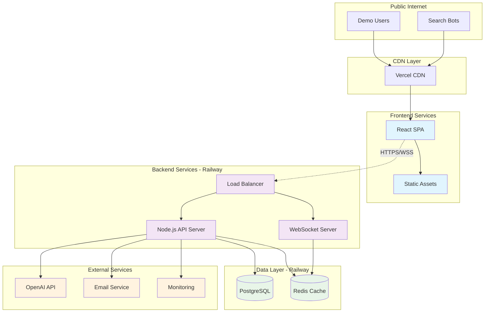
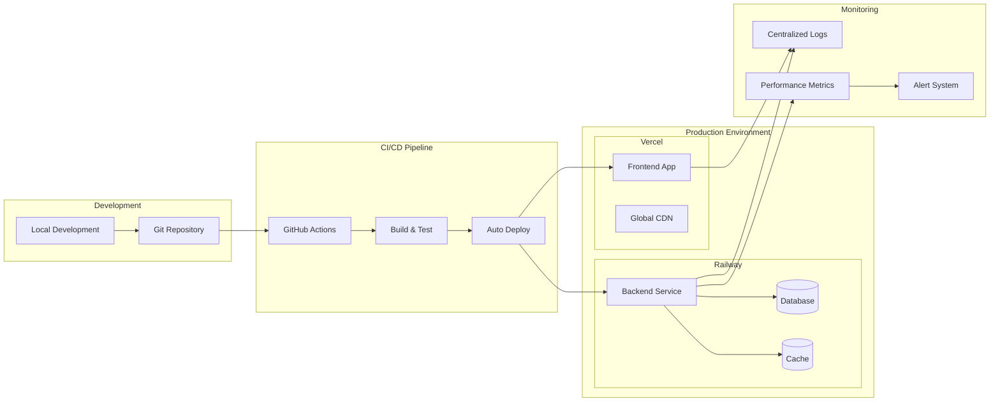
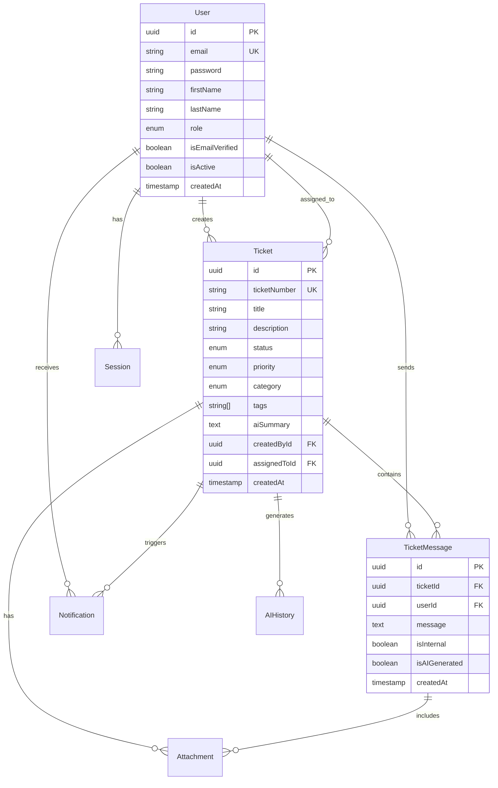

# Design Document - Live Demo Deployment

## Overview

The Live Demo Deployment feature creates a production-ready demonstration environment for the Samarthdesk AI helpdesk application. The design implements a robust, scalable architecture using modern cloud platforms (Vercel for frontend, Railway for backend services) with comprehensive monitoring, security, and automated deployment capabilities.

The demo environment showcases the complete application functionality including AI-powered ticket management, real-time communication, email integration, and multi-role user management. The architecture supports public access while maintaining security and performance standards suitable for production workloads.

## Architecture

### System Architecture Diagram



### Deployment Architecture



## Components and Interfaces

### Frontend Service (Vercel)

**Technology Stack:**
- React 18 with TypeScript
- Vite for build tooling
- TailwindCSS for styling
- React Query for state management
- Socket.IO client for real-time features

**Key Components:**
- Authentication system with JWT handling
- Ticket management interface with AI suggestions
- Real-time notification system
- File upload with progress tracking
- Responsive design for mobile and desktop
- Demo mode indicators and help tooltips

**Environment Configuration:**
```typescript
interface FrontendConfig {
  apiUrl: string;          // Backend API base URL
  wsUrl: string;           // WebSocket server URL
  appName: string;         // Demo branding
  version: string;         // Build version
  environment: string;     // production/demo
}
```

### Backend API Service (Railway)

**Technology Stack:**
- Node.js 18+ with TypeScript
- Express.js web framework
- Prisma ORM for database operations
- Socket.IO for WebSocket connections
- Bull Queue for background job processing
- Winston for structured logging

**Core Services:**
- Authentication & Authorization (JWT + refresh tokens)
- Ticket Management with AI integration
- Real-time Communication (WebSocket)
- Email Processing (SMTP/IMAP)
- File Upload & Storage Management
- Background Job Processing

**API Architecture:**
```typescript
interface APIStructure {
  '/auth': AuthenticationRoutes;
  '/users': UserManagementRoutes;
  '/tickets': TicketManagementRoutes;
  '/messages': MessageRoutes;
  '/ai': AIIntegrationRoutes;
  '/notifications': NotificationRoutes;
  '/health': HealthCheckRoutes;
}
```

### Database Service (PostgreSQL on Railway)

**Schema Design:**
- Users with role-based access control (CUSTOMER, AGENT, ADMIN)
- Tickets with status workflow and AI metadata
- Messages with attachment support
- Audit logging for all operations
- Session management with refresh tokens
- Email processing logs and AI interaction history

**Performance Optimizations:**
- Strategic indexing on frequently queried fields
- Connection pooling with automatic scaling
- Query optimization with Prisma
- Automated backup and point-in-time recovery

### Cache Service (Redis on Railway)

**Caching Strategy:**
- JWT refresh token storage with TTL
- Session data caching (7-day expiration)
- Frequently accessed user data
- AI response caching for common queries
- Rate limiting counters
- WebSocket session management

## Data Models

### Core Entity Relationships



### Demo Data Schema

**User Personas:**
```typescript
interface DemoUsers {
  admin: {
    email: 'admin@samarthdesk.com';
    role: 'ADMIN';
    access: 'full_system_access';
  };
  agent: {
    email: 'agent@samarthdesk.com';
    role: 'AGENT';
    access: 'ticket_management';
  };
  customers: Array<{
    email: string;
    role: 'CUSTOMER';
    access: 'own_tickets_only';
  }>;
}
```

**Sample Ticket Categories:**
- Technical Support (40% of tickets)
- Billing & Payment (25% of tickets)
- Bug Reports (20% of tickets)
- Feature Requests (10% of tickets)
- Account Issues (5% of tickets)

## API Specifications

### Authentication Endpoints

```typescript
// POST /api/v1/auth/register
interface RegisterRequest {
  email: string;
  password: string;
  firstName: string;
  lastName: string;
}

interface RegisterResponse {
  user: PublicUser;
  accessToken: string;
  refreshToken: string;
}

// POST /api/v1/auth/login
interface LoginRequest {
  email: string;
  password: string;
}

interface LoginResponse {
  user: PublicUser;
  accessToken: string;
  refreshToken: string;
}

// POST /api/v1/auth/refresh
interface RefreshRequest {
  refreshToken: string;
}

interface RefreshResponse {
  accessToken: string;
  refreshToken: string;
}
```

### Ticket Management Endpoints

```typescript
// GET /api/v1/tickets
interface GetTicketsQuery {
  page?: number;
  limit?: number;
  status?: TicketStatus;
  priority?: TicketPriority;
  category?: TicketCategory;
  search?: string;
  assignedTo?: string;
}

interface GetTicketsResponse {
  tickets: Ticket[];
  pagination: PaginationMeta;
}

// POST /api/v1/tickets
interface CreateTicketRequest {
  title: string;
  description: string;
  priority: TicketPriority;
  category: TicketCategory;
  tags?: string[];
}

interface CreateTicketResponse {
  ticket: Ticket;
  aiSuggestions?: AISuggestion[];
}

// POST /api/v1/tickets/:id/messages
interface CreateMessageRequest {
  message: string;
  isInternal?: boolean;
  attachments?: File[];
}

interface CreateMessageResponse {
  message: TicketMessage;
  aiResponse?: AIResponse;
}
```

### AI Integration Endpoints

```typescript
// POST /api/v1/ai/suggest-response
interface SuggestResponseRequest {
  ticketId: string;
  context: string;
  tone?: AITone;
}

interface SuggestResponseResponse {
  suggestions: string[];
  confidence: number;
  tokensUsed: number;
}

// POST /api/v1/ai/categorize-ticket
interface CategorizeTicketRequest {
  title: string;
  description: string;
}

interface CategorizeTicketResponse {
  category: TicketCategory;
  priority: TicketPriority;
  suggestedTags: string[];
  confidence: number;
}

// POST /api/v1/ai/summarize-ticket
interface SummarizeTicketRequest {
  ticketId: string;
}

interface SummarizeTicketResponse {
  summary: string;
  keyPoints: string[];
  tokensUsed: number;
}
```

### WebSocket Events

```typescript
interface WebSocketEvents {
  // Client to Server
  'join:ticket': { ticketId: string };
  'leave:ticket': { ticketId: string };
  'typing:start': { ticketId: string };
  'typing:stop': { ticketId: string };
  
  // Server to Client
  'ticket:updated': { ticketId: string; ticket: Ticket };
  'message:new': { ticketId: string; message: TicketMessage };
  'notification:new': { notification: Notification };
  'user:typing': { ticketId: string; user: PublicUser };
  'user:online': { userId: string; status: 'online' | 'offline' };
}
```

Now I need to run the prework analysis for the correctness properties since this feature includes property-based testing suitable components:

<function_calls>
<invoke name="prework">
<parameter name="featureName">live-demo-deployment